# EcologisticSA


App logística desarrollada con **Angular**, **Ionic**, **Firebase** y **Tailwind**.

## 🚚 Descripción
**EcologisticSA** es una plataforma móvil y web para la gestión de pedidos y logística, con roles como chofer, secretaria y cliente. Permite asignar, visualizar y gestionar pedidos de manera eficiente y segura.

## 🛠️ Tecnologías principales
- **Angular**: Framework principal para la construcción de la SPA.
- **Ionic**: Optimización y componentes móviles para una experiencia responsive.
- **Firebase / Firestore**: Backend en la nube, autenticación y base de datos en tiempo real.
- **Tailwind CSS**: Framework de estilos para un diseño moderno, elegante y consistente.

## 🗂️ Vistas principales

- **Inicio** (con vistas dinámicas según el rol del usuario)
- **Login y Register**
- **Cotizar envío**
- **Solicitar despacho**
- **Seguimiento de pedidos**
- **Panel de Cliente**
- **Panel de Secretaria**
- **Panel de Gerencia**
- **Panel de Chofer**

## 📱 Características

- Gestión de usuarios y autenticación con roles protegidos.
- Visualización, creación y seguimiento de pedidos.
- Interfaz moderna, responsiva y optimizada para dispositivos móviles y escritorio.
- Seguridad y protección de datos.
- Navegación y acceso dinámico según el rol del usuario.

## ⚡ Instalación rápida

1. **Clona el repositorio:**
   ```sh
   git clone https://github.com/fabrizio1x/EcologisitcSA.git
   cd EcologisitcSA
   ```
2. **Instala las dependencias:**
   ```sh
   npm install
   ```

---

## 🔑 Configuración de Firebase

1. Ve a [Firebase Console](https://console.firebase.google.com/) y crea un proyecto.
2. Crea una app web y copia la configuración de Firebase.
3. Crea los archivos:
   - `src/environments/environment.ts`
   - `src/environments/environment.prod.ts`
   Puedes usar como base los archivos de ejemplo si están disponibles.
4. Pega tus credenciales en los archivos nuevos siguiendo el formato de los ejemplos.
5. Más detalles en el archivo `FIREBASE_SETUP.txt` si está presente.

## 🏃‍♂️ Ejecución
Para desarrollo:
```sh
ionic serve
```

Para producción:
```sh
ionic build --prod
```

## 🖼️ Screenshots

A continuación, algunas capturas de la aplicación:

<p align="center">
  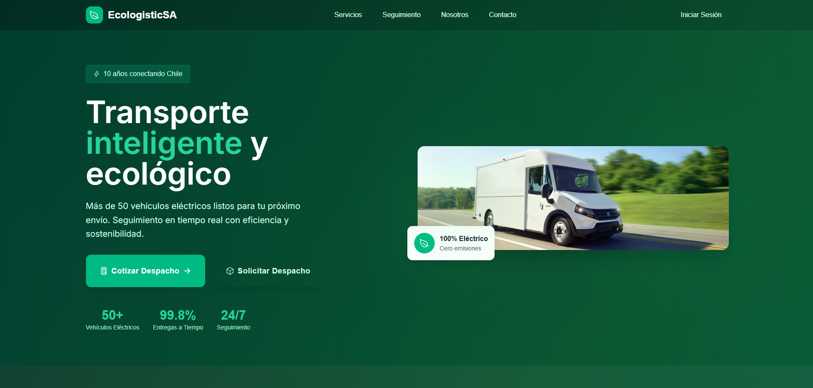
  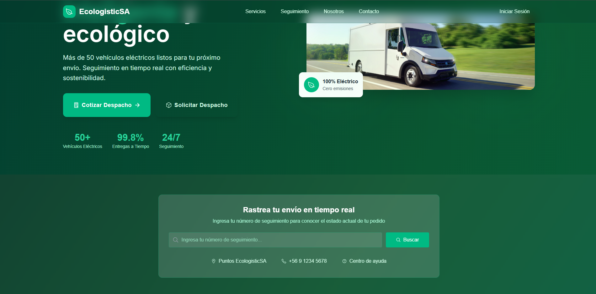
  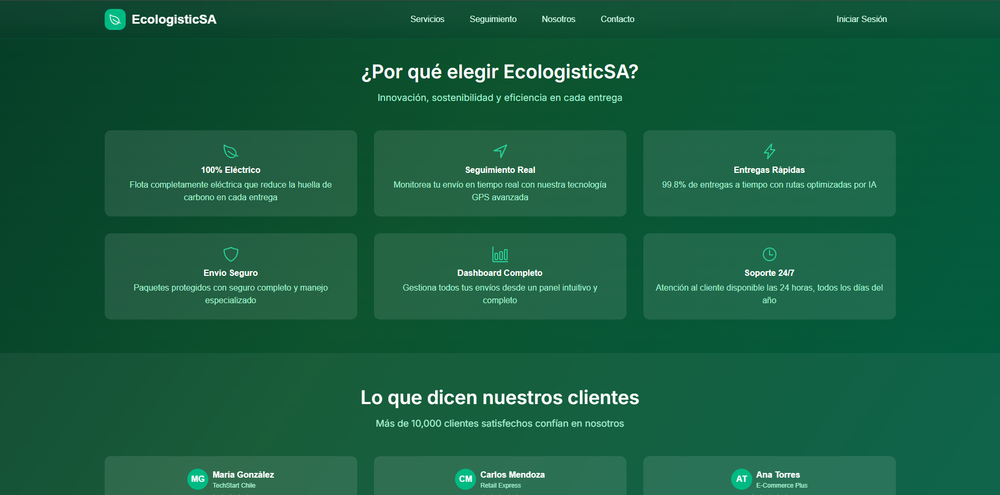
  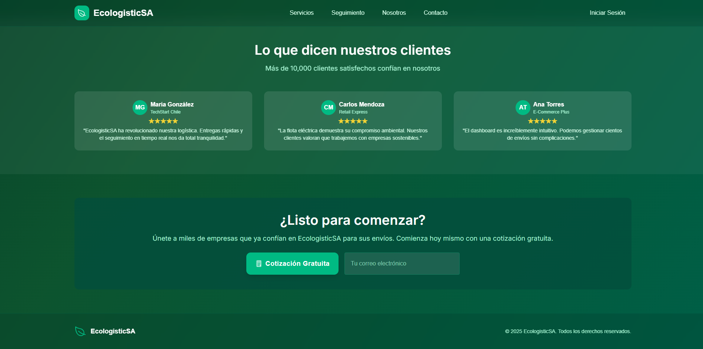
  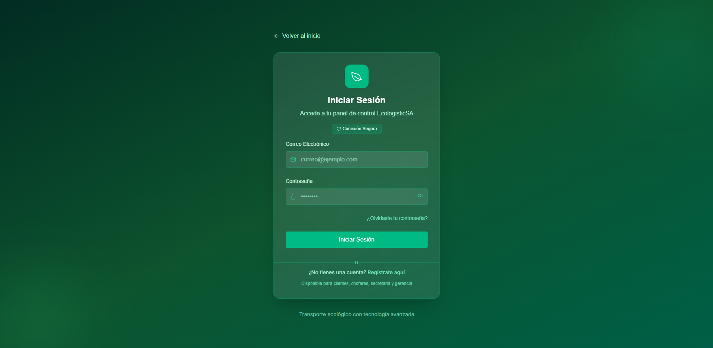
  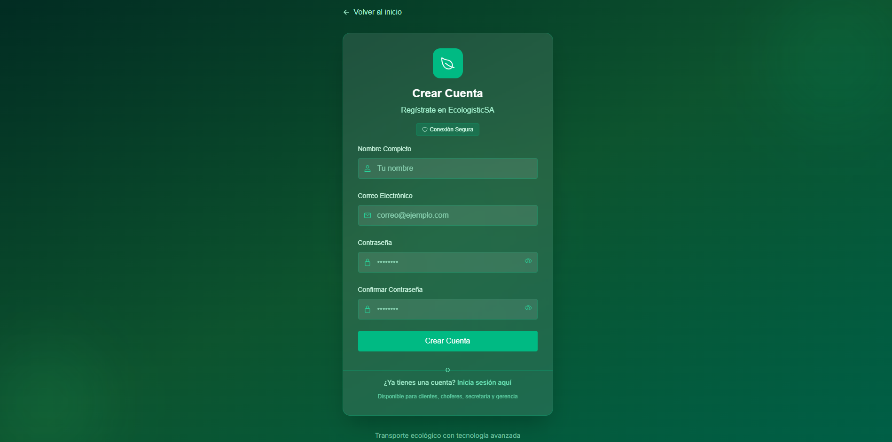
  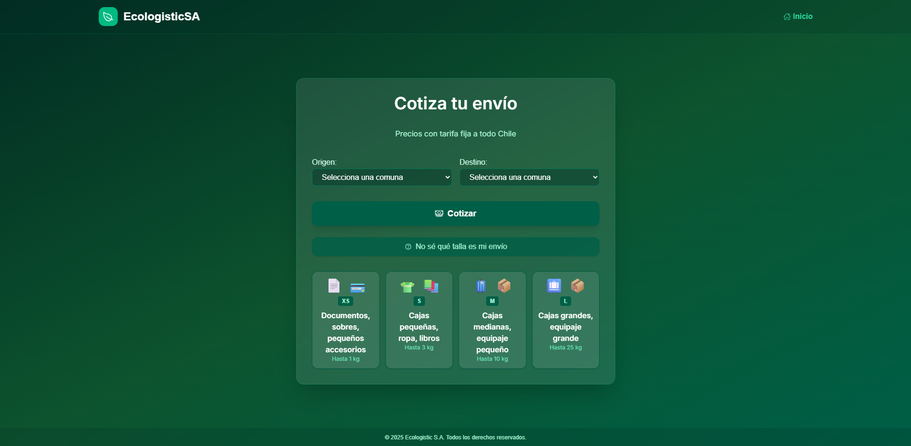
  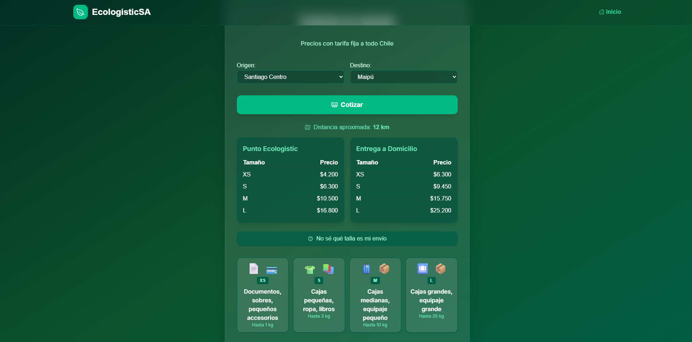
  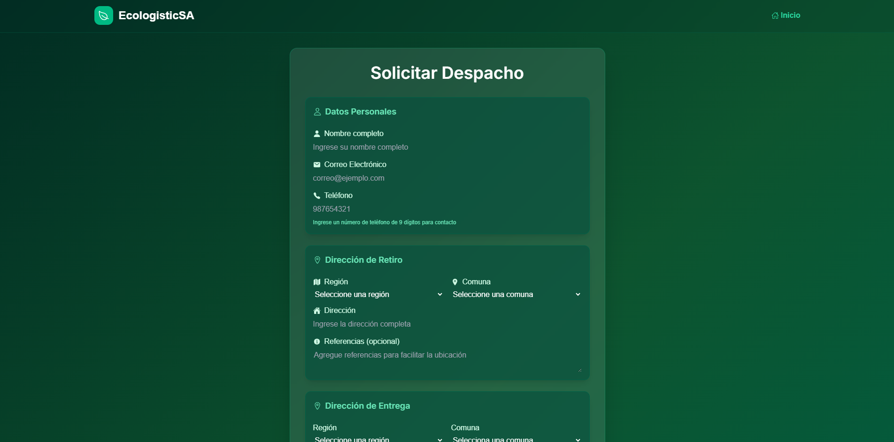
  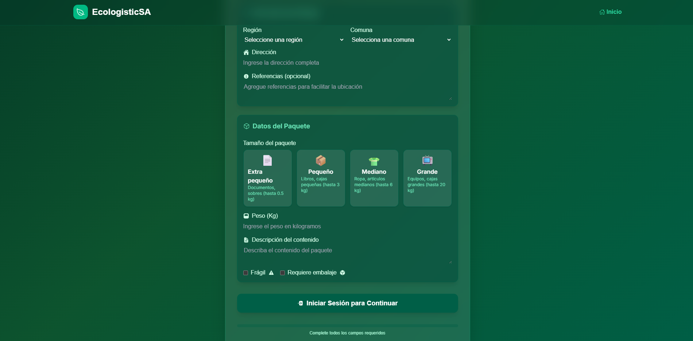
  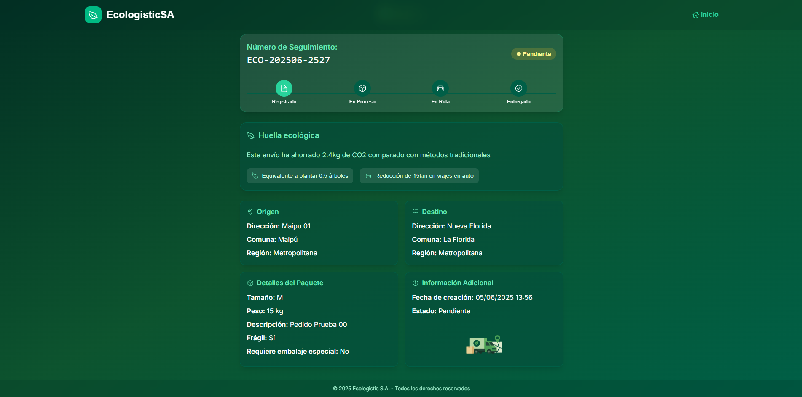
  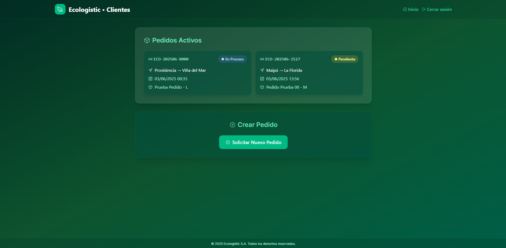
  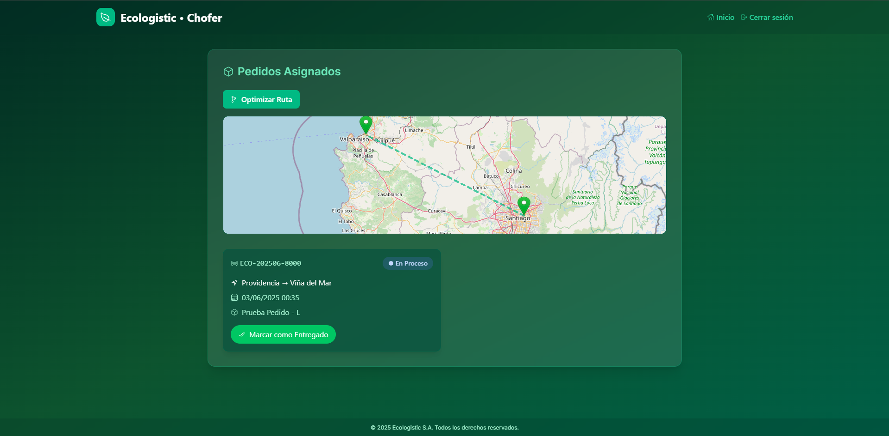
  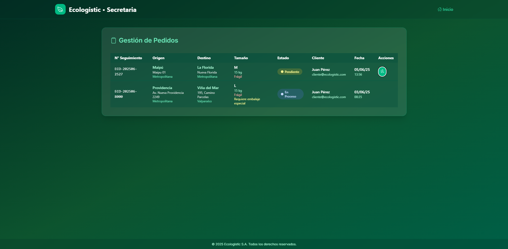
  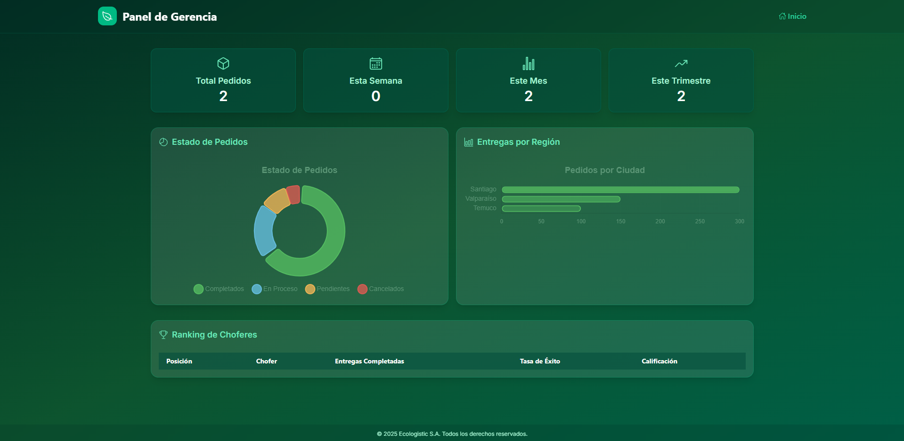
</p>

## 🤝 Contribuciones
¡Las contribuciones son bienvenidas! Por favor, abre un issue o un pull request para sugerencias o mejoras. Consulta la [guía de contribución](CONTRIBUTING.md).

## ⚖️ Licencia
Este proyecto está bajo la licencia [MIT](LICENSE).

## ⚠️ Notas de seguridad
- **No subas tus archivos `environment.ts` ni `environment.prod.ts` a ningún repositorio público.**
- Este proyecto incluye archivos de ejemplo y un instructivo para conectar tu propio backend de Firebase.

---

**Desarrollado por Fabrizio y colaboradores.** 
